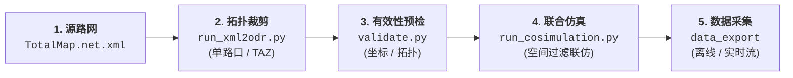
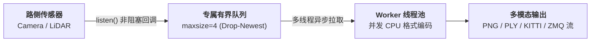

# SUMO-CARLA 交通联合仿真与数据导出工具链

[](https://www.python.org/) [](https://eclipse.dev/sumo/) [](https://carla.org/) [](https://zeromq.org/)

本工具链面向车路协同（V2X）与智能网联交通仿真场景，提供了一套贯穿 **“宏观大路网裁剪与高保真 3D 转换 → 地图拓扑有效性校验 → 场景自适应联合仿真 → 多模态路侧数据导出与实时流分发”** 的完整工程化解决方案。

---

## 1. 系统概述与核心能力

在面向大规模城市级交通仿真时，SUMO 擅长大范围宏观路网的动态流控与微观交通流模拟（如数十至数百平方公里），而 CARLA 专注于高保真 3D 物理渲染与传感器仿真。由于渲染开销限制，CARLA 无法直接承载超大范围完整路网。

本工具链针对上述工程难点实现了以下核心能力：

1. **拓扑保真裁剪与 OpenDRIVE 转换 (`xml2odr`)**：
   支持基于道路拓扑距离（非截断欧氏距离）对 SUMO 源路网（`.net.xml`）进行单路口、批量路口及 **TAZ（典型场景区域）多路口组合** 裁剪，基于最小生成树（MST）算法保证路口群间的连通性，并通过 `netconvert` 转换为 CARLA 可直接加载的 `.xodr` 格式。
2. **联仿有效性预检 (`validate.py`)**：
   在地图导入 CARLA 前，从 **坐标系全局对齐**、**车道与转向拓扑完整性**、**netconvert 双向往返（Round-trip）重构** 三个维度进行自动校验，提前暴露由于路网加工引入的结构性缺陷。
3. **自适应联合仿真桥接 (`run_cosimulation.py`)**：
   基于 CARLA 同步模式实现 SUMO（主导交通流与信号灯）与 CARLA（3D 可视化与物理模拟）的双向同步。内置**动态场景包围盒（Scene Box）过滤机制**，自动屏蔽 CARLA 视界之外的大范围背景车辆生成，兼顾大规模交通流真实度与渲染性能。
4. **可插拔多模态数据导出框架 (`data_export`)**：
   解耦于主仿真循环的轻量化数据采集框架，支持路侧相机（RGB）、激光雷达（LiDAR PLY/BIN）、KITTI 标准格式离线数据集导出，以及基于 ZeroMQ 的低延迟实时数据流推送（PUB/SUB），并提供交互式运行时控制通道（`export_control.py`）。

---

## 2. 项目目录结构

```
.
├── toolchain_env.py               # 统一环境与路径解析器
├── run_xml2odr.py                 # 路网裁剪与 .xodr 转换主入口
├── list_junctions.py              # 路网信号灯路口查询工具
├── validate.py                    # 地图联仿有效性与拓扑校验工具
├── run_cosimulation.py            # SUMO + CARLA 联合仿真运行入口
├── tp.py                          # CARLA 视点传送与坐标核验工具
├── spectator_coords.py            # CARLA 观察者位姿读取与点位记录
├── plan_lidar_points.py           # 路侧 LiDAR 自动化布点规划器
├── export_control.py              # 仿真运行时数据导出控制客户端
├── stream_consumer.py             # ZeroMQ 实时流数据消费参考客户端
├── bin2pcd.py                     # KITTI .bin 点云转 PCD 工具
│
├── config/                        # 集中配置文件目录
│   ├── toolchain.json             # 基础环境与依赖路径配置
│   ├── intersections.json         # 目标路口 ID 与坐标映射表
│   ├── taz.json                   # TAZ 典型区域划分配置（多路口组合）
│   ├── export.example.json        # 数据导出全量配置示例
│   └── export_configs/            # 各场景地图对应的导出配置目录
│
├── xml2odr/                       # 路网拓扑裁剪核心模块
│   ├── graph_model.py             # 路网拓扑数据模型（Edge, Junction, Lane 等）
│   ├── net_parser.py              # SUMO .net.xml 流式 XML 解析器
│   ├── topological_clipper.py     # BFS 拓扑裁剪与 MST 区域连通算法
│   ├── net_writer.py              # 裁剪子网 XML 序列化输出器
│   ├── netconvert_runner.py       # netconvert 转换任务封装
│   ├── batch_clip.py              # 批量与多场景处理编排
│   └── cli.py                     # 命令行接口定义
│
└── data_export/                   # 数据采集与导出框架
    ├── base.py                    # Exporter 抽象基类与注册中心
    ├── config.py                  # 导出配置加载与校验（含 FPS 对齐）
    ├── sensors.py                 # SensorFarm（传感器管理与多线程 Worker）
    ├── manager.py                 # ExporterManager 生命周期编排与容错
    ├── calibration.py             # 针孔相机与多传感器标定矩阵计算
    ├── selfcheck.py               # 离线环境与功能自检
    └── exporters/                 # 各格式导出器实现（RGB / LiDAR / KITTI / Stream）
```

---

## 3. 运行环境要求与统一配置

### 3.1 基础依赖

- **Python**：>= 3.8
- **SUMO**：>= 1.12.0（需配置 `SUMO_HOME` 环境变量，确保 `netconvert` 与 `traci` 可调用）
- **CARLA**：0.9.13+（需已安装 Python API 包 `carla`，推荐源码编译版或独立发布版）
- **Python 依赖库**：`pyzmq`, `Pillow`, `numpy`（用于流式分发与图像处理）

### 3.2 环境路径配置 (`config/toolchain.json`)

项目使用 `toolchain_env.py` 集中管理所有外部路径依赖。缺省项会自动回退至系统环境变量或相对默认路径：

```json
{
  "sumo_home": "/usr/share/sumo",
  "carla_root": "/opt/carla-0.9.16",
  "sumo_toolkit_dir": "/opt/carla-0.9.16/Co-Simulation/Sumo",
  "exports_dir": "../../data/exports",
  "maps_xodr_dir": "../../data/maps/xodr",
  "maps_carla_dir": "../../data/maps/carla",
  "totalmap_net": "../../data/maps/sumo/generated/network/TotalMap_20.signals.net.xml"
}
```

```bash
# 验证环境配置与可用组件
python run_cosimulation.py --check-env
```

## 4. 核心工作流与使用指南

整个工具链的标准工作流如下图所示：



---

### 4.1 路网拓扑裁剪与格式转换 (`run_xml2odr.py`)

#### 4.1.1 查询路口信息

```bash
# 列出源路网中所有受控路口的 ID、坐标及车道数
python list_junctions.py
python list_junctions.py /path/to/custom_net.net.xml
```

#### 4.1.2 单路口与批量裁剪

沿道路拓扑（非几何直线截断）向外扩展指定距离，保证生成的路网具有完整的边、路口及转向连接：

```bash
# 单路口裁剪并转换为 .xodr（默认读取 toolchain 配置中的源路网）
python run_xml2odr.py --junction 4427 --dist 150 -o demo_1.xodr

# 保留裁剪后的中间文件 *.clipped.net.xml 以供调试
python run_xml2odr.py --junction 4427 --dist 150 -o demo_1.xodr --keep-net

# 批量裁剪 config/intersections.json 中定义的所有路口
python run_xml2odr.py --config config/intersections.json --dist 150 --output-dir ../../data/maps/xodr
```

#### 4.1.3 TAZ（典型区域）多路口组合裁剪

TAZ（Typical Area Zone）模式用于将多个关联路口组合为一个连续的典型区域场景（如商业区、走廊干道）。系统自动通过**最小生成树（MST）**算法提取路口间的连通干道，并对各个路口按需拓扑展开。

1. **配置 TAZ 区域 (`config/taz.json`)**：
   ```json
   {
     "version": "1.0",
     "taz_groups": [
       {
         "name": "EastZone",
         "intersections": ["demo_3", "demo_5", "demo_6", "demo_9"]
       }
     ]
   }
   ```
2. **执行 TAZ 裁剪**：
   ```bash
   # 裁剪指定 TAZ 区域
   python run_xml2odr.py --taz-config config/taz.json --taz EastZone --dist 150 -o EastZone.xodr
   
   # 批量裁剪所有定义的 TAZ 区域
   python run_xml2odr.py --taz-config config/taz.json --dist 150 --output-dir ../../data/maps/xodr
   ```

#### 4.1.4 裁剪机制概述

TAZ 裁剪采用**三阶段拓扑保真策略**：
1. **阶段 A（MST 连通骨干）**：计算种子路口间最短路径并构建最小生成树，无条件保留骨干道路与中间路口；
2. **阶段 B（多级 BFS 展开）**：种子路口以 `--dist` 展开，路径路口以 `--path-dist` 展开，保留边界道路不截断；
3. **阶段 C（元数据保真）**：完整提取内部边、车道级转向关系与信号灯配时逻辑。

> 完整算法形式化伪代码与数学证明详见 [深度技术文档 (carla_cosimulation.md)](file:///Users/faye_aki/Codes/citypulse-v2x-sim/simulation/carla/carla_cosimulation.md#313-算法形式化伪代码)。

##### 裁剪核心参数说明

| 参数 | 适用模式 | 默认值 | 说明 |
|---|---|---|---|
| `--net` | 通用 | `toolchain.json: totalmap_net` | 源 SUMO `.net.xml` 路径 |
| `--junction` | 单路口 | — | 种子路口 ID |
| `--config` | 批量路口 | — | 路口映射配置路径（如 `config/intersections.json`） |
| `--taz-config` | TAZ 模式 | — | TAZ 区域配置文件路径（如 `config/taz.json`） |
| `--taz` | 单 TAZ | — | 指定处理的 TAZ 分组名称 |
| `--dist` | 通用 | `200` | 种子路口沿道路的拓扑扩展距离（米） |
| `--path-dist` | TAZ 模式 | `50` | MST 中间路径路口的保护性扩展距离（米） |
| `--output` / `-o` | 单体模式 | — | 输出 `.xodr` 文件路径 |
| `--output-dir` | 批量模式 | `../../data/maps/xodr` | 批量产物输出目录 |
| `--keep-net` | 通用 | `False` | 是否保留裁剪生成的中间 `.clipped.net.xml` |
| `--skip-netconvert`| 通用 | `False` | 跳过 OpenDRIVE 格式转换，仅输出 XML 子网 |

---

### 4.2 地图联仿有效性校验 (`validate.py`)

由于 OpenDRIVE 地图在经过 RoadRunner / UE 编辑加工后可能发生几何偏移或车道拓扑破坏，`validate.py` 提供了导入 CARLA 前的自动化结构校验：

```bash
# 自动在 maps/carla 与 maps/xodr 目录下寻找同名地图执行校验
python validate.py EastZone
```

#### 三项核心检查

| 检查维度 | 核心检测项 | 判定准则与影响 |
|---|---|---|
| **A. 坐标对齐** | 计算 XODR 路口几何中心与 SUMO Junction 的系统性平移偏差 | - $\Delta < 3\text{m}$：正常几何估算噪声；<br>- $3\text{m} \le \Delta < 10\text{m}$：⚠️ 允许联仿，建议复核；<br>- $\Delta \ge 10\text{m}$：❌ 联仿不可用，输出建议平移补偿量。 |
| **B. 路口拓扑** | 逐路口比对连接分支（Arms）、入向 Driving 车道数与流向连通关系 | - 手臂缺失：❌ 存在断头路或非连通分支；<br>- 车道数/转向差异：⚠️ 结构微调告警。 |
| **C. 双向往返（Round-trip）** | 调用 CARLA 标准 netconvert 参数将 XODR 逆向还原为 net.xml 并比对 | - 区域覆盖率 $< 90\%$：⚠️ 几何信息丢失；<br>- 逆向解析失败 / 空路网 / 拓扑冲突：❌ 破坏 CARLA 内部路网重建。 |

#### 退出码定义

- `0 (OK)`：完全通过（理论保留值）。
- `1 (WARNING)`：存在可容忍偏差（如微量坐标偏移或车道微调），可进行联仿。
- `2 (ERROR)`：严重错误（偏移 $\ge 10\text{m}$、拓扑断裂），联仿不可用。
- `3 (FATAL)`：运行故障（文件缺失、解析器崩溃）。

---

### 4.3 SUMO + CARLA 联合仿真 (`run_cosimulation.py`)

#### 4.3.1 运行命令

```bash
# 1. 基础启动（自动根据地图计算场景包围盒并加载同名导出配置）
python run_cosimulation.py \
    --sumocfg ../../data/maps/sumo/generated/traffic/global/off_peak/simulation.sumocfg \
    --carla-map EastZone \
    --max-time 3600

# 2. 启用 SUMO GUI 与指定路口聚焦
python run_cosimulation.py \
    --sumocfg ../../data/maps/sumo/generated/traffic/global/off_peak/simulation.sumocfg \
    --carla-map EastZone \
    --junction demo_3 \
    --sumo-gui

# 3. 连接远程 CARLA 服务端
python run_cosimulation.py \
    --sumocfg ../../data/maps/sumo/generated/traffic/global/off_peak/simulation.sumocfg \
    --carla-map EastZone \
    --carla-host 192.168.1.100 --carla-port 2000
```

#### 4.3.2 仿真运行状态面板

仿真启动后，主控终端每秒刷新同步状态：

```text
[EastZone] sim=   120.0s  wall=    96s  rt= 0.80x  fps=  20.0  actors=   38
```

- `[EastZone]`：当前 CARLA 运行的世界场景名称。
- `sim`：当前仿真内部累计推进时间。
- `wall`：宿主机实际运行流逝时间。
- `rt (Real-time Ratio)`：实时倍率（$\text{wall} / \text{sim}$），$<1.0$ 表示仿真快于实时间隔。
- `fps`：CARLA 同步步长换算帧率。
- `actors`：当前在 CARLA 场景框内被实例化渲染的动态车辆总数。

#### 4.3.3 核心参数列表

| 参数 | 必需 | 默认值 | 说明 |
|---|---|---|---|
| `--sumocfg` | ✓ | — | SUMO 仿真工程配置文件路径（`.sumocfg`） |
| `--carla-map` | ✓ | — | CARLA 目标地图资产名称（如 `EastZone`） |
| `--junction` | | — | 仿真启动时观察者自动聚焦的 SUMO 路口 ID |
| `--step-length` | | 读取 sumocfg | 同步步长（秒），未配置时回退至 `0.05` (20 Hz) |
| `--max-time` | | `3600` | 最大仿真推进时长（秒） |
| `--sumo-gui` | | `False` | 启动 SUMO 图形化界面 |
| `--carla-host` / `--carla-port`| | `127.0.0.1:2000`| CARLA 服务端网络端点 |
| `--scene-box` | | 自动计算 | 手动指定渲染边界 `Xmin,Ymin,Xmax,Ymax` |
| `--export` | | — | 启用的导出器列表（如 `rgb_camera,lidar` 或 `stream`） |
| `--export-config` | | 自动匹配 | 导出配置文件路径或 `config/export_configs/` 下的配置名 |

---

### 4.4 视点定位与观察者控制 (`tp.py` / `spectator_coords.py`)

在联合仿真运行期间，由于 SUMO 大地图坐标原点距离局部场景可能达数十公里，可使用专用工具快速定位视点：

```bash
# 传送至指定 TAZ 路口正上方 10m 俯视（自动匹配当前地图组）
python tp.py demo_3

# 传送至指定 CARLA 空间绝对坐标 (X, Y, Z)
python tp.py 21807.28 -42363.87 25.0
python tp.py -- -123.45 -678.90 25.0  # 负数坐标需添加 -- 分隔符

# 读取当前 CARLA 窗口观察者的精确坐标与位姿
python spectator_coords.py --once
```

> **同步安全性说明**：`tp.py` 与 `spectator_coords.py` 作为第二客户端连接 CARLA 时，**严格禁止调用 `world.tick()`**，仅执行 Transform 更新或缓存读取，绝不干扰 SUMO-CARLA 主时钟同步。

---

## 5. 多模态数据采集与导出系统 (`data_export`)

`data_export` 是一套与主仿真逻辑解耦的高性能传感器数据采集系统，采用 **生产者-有界队列-异步 Worker 线程池** 架构，确保主仿真循环零阻塞。



---

### 5.1 传感器点位规划与配置

#### 5.1.1 路侧 LiDAR 自动布点 (`plan_lidar_points.py`)

一键为 TAZ 各路口中心规划 360° 全覆盖路侧 LiDAR 并写入地图配置文件：

```bash
# 预览布点坐标与覆盖半径
python plan_lidar_points.py --taz WestZone --dry-run --print-coverage

# 正式写入 config/export_configs/WestZone.json
python plan_lidar_points.py --taz WestZone --range 50 --z 6.0
```

#### 5.1.2 手动标定路侧相机 (`spectator_coords.py`)

在 CARLA 窗口将观察者移动至目标点位后执行：

```bash
# 自动追加/更新当前地图对应配置文件中的相机位姿
python spectator_coords.py --once --save --save-name cam_01
```

#### 5.1.3 传感器配置文件规范

```json
{
  "version": 1,
  "output": {
    "fps": 30,
    "export_dir": "../../data/exports",
    "stream": {
      "bind": "tcp://127.0.0.1:19091",
      "jpeg_quality": 85,
      "lidar_compress": true
    }
  },
  "sensors": [
    {
      "name": "cam_01",
      "type": "rgb_camera",
      "transform": {"x": 1200.5, "y": -800.3, "z": 6.0, "pitch": -20.0, "yaw": 90.0, "roll": 0.0},
      "width": 1920,
      "height": 1080,
      "fov": 90.0,
      "write_threads": 4
    },
    {
      "name": "lidar_01",
      "type": "lidar",
      "transform": {"x": 1200.5, "y": -800.3, "z": 6.0, "pitch": 0.0, "yaw": 0.0, "roll": 0.0},
      "channels": 64,
      "range": 50.0,
      "points_per_second": 1000000,
      "rotation_frequency": 20,
      "upper_fov": 10.0,
      "lower_fov": -30.0
    }
  ]
}
```

---

### 5.2 离线数据集导出

#### 5.2.1 启动文件导出

```bash
# 导出 RGB 相机与 LiDAR（生成 PNG 序列 + PLY 点云）
python run_cosimulation.py --sumocfg simulation.sumocfg --carla-map EastZone \
    --export rgb_camera,lidar --max-time 60

# 导出 KITTI 规范格式数据集（image_2 / velodyne / calib.txt）
python run_cosimulation.py --sumocfg simulation.sumocfg --carla-map EastZone \
    --export kitti --max-time 60
```

#### 5.2.2 产物目录结构与标定定义

```text
data/exports/<MapName>/<YYYYmmdd-HHMMSS>/
├── meta.json               # 仿真与采集元数据统计 (帧数、丢帧率、处理延迟)
├── run_config.json         # 运行时生效的完整传感器配置快照
├── manifest.jsonl          # 全局逐 Tick 帧索引与环境状态记录
└── sensors/
    ├── cam_01/
    │   ├── calibration.json# 传感器内外参标定矩阵
    │   ├── manifest.jsonl  # 相机帧级索引文件
    │   └── frame_000001.png
    └── lidar_01/
        ├── manifest.jsonl
        └── frame_000001.ply
```

- **标定矩阵 (`calibration.json`)**：
  - 内参 $K$ 基于针孔模型计算：$f_x = f_y = \frac{W / 2}{\tan(\text{FOV} / 2)}$，$c_x = W/2$，$c_y = H/2$。
  - 外参提供 $4 \times 4$ 齐次变换矩阵 $T_{wc}$（Camera $\to$ World）与 $T_{cw}$（World $\to$ Camera）。

---

### 5.3 实时数据流分发 (`stream`)

通过 ZeroMQ PUB/SUB 通道将传感器数据以极低延迟推送至下游算法模块（如路侧边缘计算、目标检测、协同感知）：

```bash
# 联仿端启动实时流发布（默认绑定 tcp://127.0.0.1:19091）
python run_cosimulation.py --sumocfg simulation.sumocfg --carla-map EastZone --export stream
```

- **数据帧格式**：采用 3-part 消息包 `[Topic, HeaderJSON, BinaryPayload]`。
  - `Topic`：传感器标识名。
  - `HeaderJSON`：包含 `kind`, `seq`, `sim_time`, `world_frame`, `transform`。
  - `BinaryPayload`：RGB 相机为高质量 JPEG 编码字节流；LiDAR 为标准 Float32 (X, Y, Z, Intensity) 二进制点云。

项目内提供了一个消费端示例（stream_consumer.py），可以用于模拟消费端的数据接收情况，也支持写盘模式，将数据写入磁盘直接查看效果。

```bash

# 消费端订阅数据流（支持先于联仿启动，自动重连）
python stream_consumer.py
python stream_consumer.py --sensors cam_01 # 只订阅特定的sensor
python stream_consumer.py --save-dir ./recv_stream # 写盘模式
```


---

### 5.4 运行时导出交互控制 (`export_control.py`)

支持在联仿不中断的前提下，通过独立的命令行客户端控制数据录制状态：

```bash
python export_control.py status       # 查询当前采集状态与统计
python export_control.py start        # 开启新段数据采集（新建时间戳子目录）
python export_control.py pause        # 暂停写入（仿真保持推进）
python export_control.py resume       # 恢复写入
python export_control.py stop         # 结束当前录制段并完成 Manifest 封包
```

---

### 5.5 性能调优与架构扩展

1. **帧率与仿真步长对齐**：
   CARLA 同步模式下，传感器触发频率受限于仿真步长：$\text{有效 FPS} = \min(\text{请求 FPS}, \frac{1}{\text{step\_length}})$。
   - 步长 $0.05\text{s} \implies$ 最高支持 $20\text{Hz}$ 采样。
   - 如需标准 $30\text{Hz}$ 采集，需将仿真步长配置为 $0.033333\text{s}$。
2. **多线程并发编码调优**：
   在 CPU 资源充足的多核平台上，可通过调大高负载传感器的 `write_threads`（如相机设为 `4~8`）消除 `sensor queue full` 告警。
3. **扩展自定义导出器**：
   继承 `data_export.base.Exporter` 并使用 `@register("name")` 修饰器，即可无侵入式接入采集管线。

---

## 6. 技术参考与附录

### 6.1 坐标系与位姿转换映射

| 系统 | 空间手性 | X 轴 | Y 轴 | Z 轴 | 偏航角 (Yaw) 0° 基准 |
|---|---|---|---|---|---|
| **SUMO** | 右手系 | 正东 (East) | 正北 (North) | 垂直向上 | 正北 (顺时针为正) |
| **CARLA (Unreal)** | 左手系 | 正东 (East) | 正南 (South) | 垂直向上 | 正东 (逆时针为正) |

$$\begin{cases}
X_{\text{carla}} = X_{\text{sumo}} \\
Y_{\text{carla}} = -Y_{\text{sumo}} \\
\text{Yaw}_{\text{carla}} = 90^\circ - \text{Angle}_{\text{sumo}}
\end{cases}$$

### 6.2 车辆类别 Blueprint 映射

| SUMO `vClass` | CARLA Blueprint | 车型说明 |
|---|---|---|
| `passenger` | `vehicle.audi.a2` | 普通乘用车 |
| `truck` | `vehicle.carlamotors.european_hgv` | 重型货车 |
| `bus` | `vehicle.mitsubishi.fusorosa` | 大中型客车 |
| `motorcycle` | `vehicle.kawasaki.ninja` | 摩托车 / 两轮车 |
| `emergency` | `vehicle.dodge.charger_police` | 特种执勤车 |

---

## 7. 常见问题排查 (FAQ)

### Q1: 进入 CARLA 场景后画面为空白/无法看到道路模型？
- **原因**：CARLA 默认观察者位于世界坐标原点 $(0, 0, 0)$，而 SUMO 裁剪地图可能位于数万米之外的真实坐标系。
- **解决办法**：使用 `python tp.py <路口名>` 传送至目标路口，或在 `run_cosimulation.py` 启动参数中指定 `--junction <ID>` 自动聚焦。

### Q2: 为什么 SUMO 中的部分背景车辆没有在 CARLA 中生成？
- **机制说明**：此为预期设计。`run_cosimulation.py` 基于 CARLA 路网边界自动构建场景包围盒（Scene Box），仅动态同步位于局部场景及其周边缓冲带内的车辆，场景外的宏观背景流仅在 SUMO 内部演算，以保证渲染帧率。

### Q3: 裁剪后的路网在 CARLA 导入时报错或拓扑断裂？
- **解决办法**：
  1. 运行 `python validate.py <地图名>` 进行三维坐标对齐与拓扑一致性核查。
  2. 对于孤立路口，适当增大 `--dist` 距离（建议 $100\text{m} \sim 200\text{m}$）；
  3. 对于多路口组合，检查 `config/taz.json` 中配置的路口是否存在可达路径，调整 `--path-dist` 确保 MST 连通路径上的转弯连接完整。
