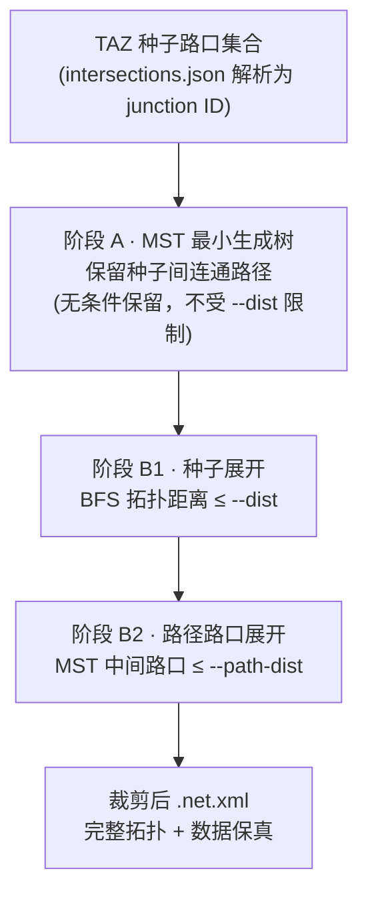
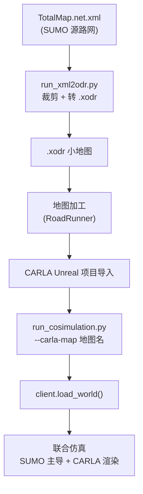
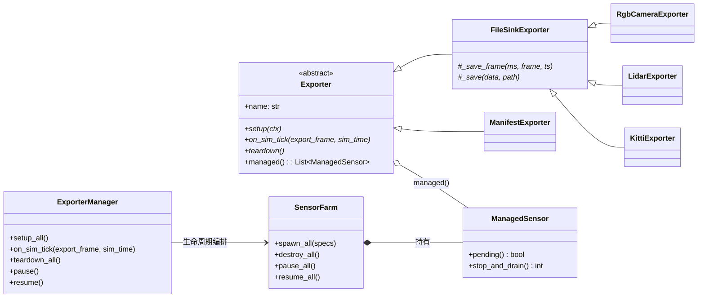
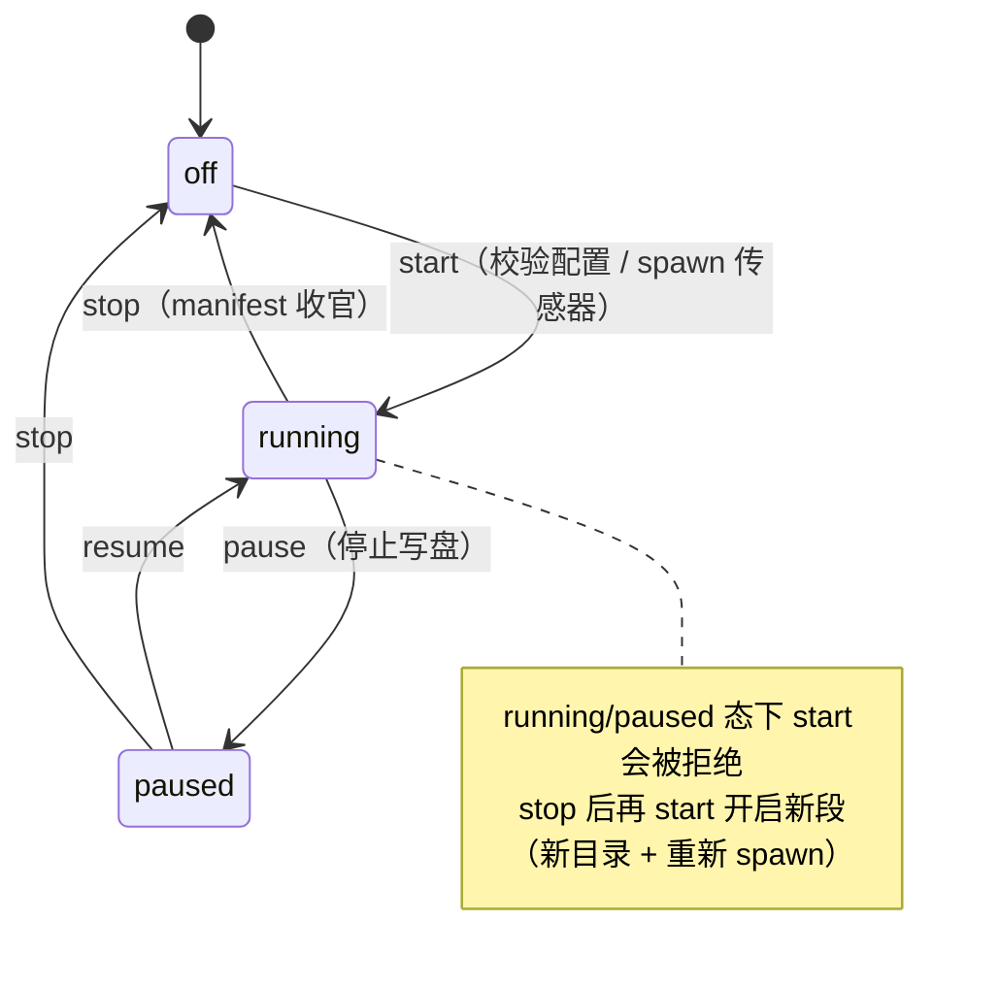
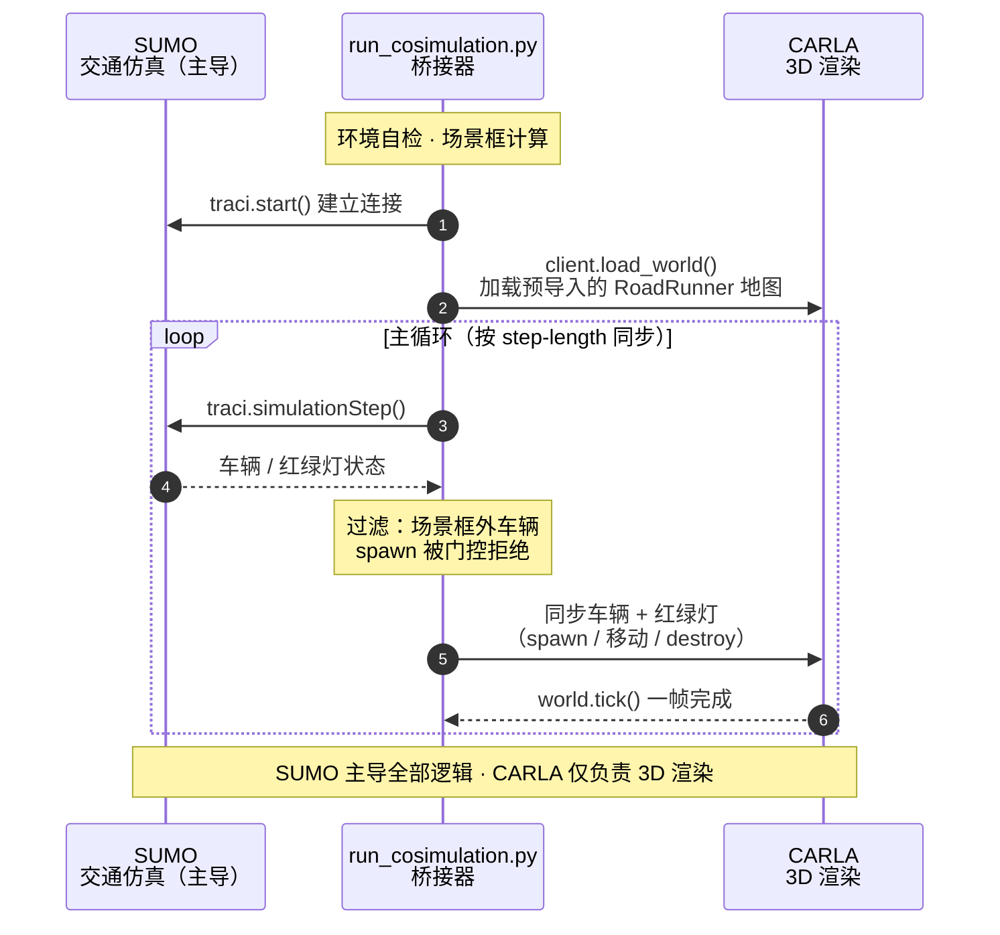

# XML2Odr — SUMO 大地图 2D 路口裁剪 & CARLA 3D 联合仿真工具链

## 业务问题

赛题给出的20个路口组合形成的`SUMO`路网非常大（200km^2左右）。受限于设备性能，`CARLA` 只能渲染小范围典型场景地图。要将 SUMO 的交通仿真与 `CARLA` 的 3D 可视化结合起来，需要把大型路网**按需裁剪**为小尺寸 `.xodr` 文件，对应每个路口或典型场景区域（TAZ）。

在确定好了所需路口在`SUMO`路网中的`junction_ID`，并以`JSON`格式配置好了之后（比如`config/intersections.json`)，通过本工具即可将每个路口从`SUMO`路网中单独裁剪出来，也可通过 **TAZ 模式**（需要自行将每个TAZ所包含的路口以`JSON`的格式配置好）直接将多个路口合并为一个典型场景进行裁剪，通过最小生成树保留路口间的连通路径，得到一个多路口组合的场景小地图。将其导入`CARLA`后，我们还需解决联合仿真时`SUMO`大地图和`CARLA`小路网之间不统一的问题。在`CARLA`官方的联仿工具的基础上，我们新加入了一层过滤层——将存在于`SUMO`大地图中但不位于`CARLA`小场景中的车辆给过滤掉，其余车辆保留并正常参与仿真和渲染。

在确保联合仿真可以正常运行之后，我们需要从CARLA中导出我们所需的数据，本工具也实现了便利于二次开发的CARLA数据导出工具，只需要简单地修改配置文件，就可以一键实现数据的自动导出。

本工具链的主要功能如下：

| 环节 | 工具 | 说明 |
|---|---|---|
| 裁剪转换 | `run_xml2odr.py` | 从大路网中按路口 ID 或 TAZ 组裁剪出小 `.net.xml`，再转换为 `.xodr`。支持单路口、批量路口、TAZ 三种模式。 |
| 地图检验 | `validate.py` | 将加工后的地图与`.net.xml`进行比对，判断其联仿有效性。 |
| 联合仿真 | `run_cosimulation.py` | 一键启动 `SUMO` + `CARLA`：加载准备好的小范围路网地图，执行过滤。 |
| 数据导出 | `data_export` | 一个支持拓展和二次开发的数据导出框架，可以方便地配置需要导出的CARLA数据。 |

## 项目结构

```
XML2Odr/
├── README.md
├── toolchain_env.py               # 统一环境路径解析
├── run_xml2odr.py                 # 主入口：裁剪 + 转换为 .xodr
├── list_junctions.py              # 辅助：列出信号灯路口 ID
├── validate.py                    # 地图联仿有效性校验
├── run_cosimulation.py            # SUMO + CARLA 联合仿真启动脚本
├── spectator_coords.py            # 读取 spectator 位姿；--save 记录传感器点位
├── plan_lidar_points.py           # 按 TAZ 自动生成路侧 lidar 点位
├── bin2pcd.py                     # KITTI .bin转换.pcd脚本
│
├── config/                        # 全部 JSON 配置统一目录
│   ├── intersections.json         # 20 个 demo 路口 ID 坐标映射表
│   ├── taz.json                   # TAZ 典型场景区域配置（多路口组合裁剪）
│   ├── export.example.json        # 数据导出配置示例（点位 + 参数）
│   ├── toolchain.json             # 环境路径统一配置文件
│   └── export_configs/            # 每地图导出配置
│
├── xml2odr/                       # xml裁切模块
│   ├── __init__.py
│   ├── graph_model.py             # 数据模型 (Edge, Junction, Lane…)
│   ├── net_parser.py              # SUMO .net.xml 流式解析器 (iterparse)
│   ├── topological_clipper.py     # BFS 拓扑距离裁剪算法
│   ├── net_writer.py              # 输出裁剪后的 .net.xml
│   ├── netconvert_runner.py       # 调用 netconvert 转换为 .xodr
│   ├── batch_clip.py              # 批量处理模块
│   └── cli.py                     # 命令行入口
│
└── data_export/                   # 数据导出框架
    ├── base.py                    # Exporter 抽象基类 + 注册表
    ├── config.py                  # 导出配置加载/校验/fps 对齐
    ├── sensors.py                 # SensorFarm：spawn 传感器 + writer 线程模型
    ├── manager.py                 # 生命周期编排 + 异常隔离
    ├── calibration.py             # 相机标定数学（内参/外参，惰性依赖 carla）
    ├── selfcheck.py               # 离线自检
    └── exporters/                 # 内置导出器：rgb_camera / lidar / kitti / manifest
```

## 运行环境要求

- **Python 3.8+**
- **SUMO** — 设置 `SUMO_HOME` 环境变量，确保 `netconvert` 可用
- **CARLA**（仅联合仿真需要）— 服务端运行中，Python 包 `carla` 已安装

### SUMO/CARLA 路径统一配置（config/toolchain.json）

`run_xml2odr.py`、`run_cosimulation.py`、`validate.py`、`spectator_coords.py` 统一经 `toolchain_env.py` 解析 SUMO/CARLA 路径，配置优先级：

**CLI 参数 > 环境变量（`SUMO_HOME`/`CARLA_ROOT`）> `config/toolchain.json` > PATH（netconvert 二进制）**

```json
// config/toolchain.json（空值 = 不配置，回落到环境变量/默认值；相对路径以 XML2Odr/ 为基准）
{
  "sumo_home": "/usr/share/sumo", // SUMO 安装目录
  "carla_root": "/home/kemove/devdata1/zrl/software/carla-0.9.16-src",  // CARLA 源码目录
  "sumo_toolkit_dir": "/home/kemove/devdata1/zrl/software/carla-0.9.16-src/Co-Simulation/Sumo", // 官方联仿工具包目录（含 util/data/opendrive_netconvert.typ.xml
  "exports_dir": "../../data/exports",         // CARLA 导出数据根目录（联仿 --export）
  "maps_xodr_dir": "../../data/maps/xodr",     // xml2odr 产物目录
  "maps_carla_dir": "../../data/maps/carla",   // CARLA 地图目录
  "totalmap_net": "../../data/maps/sumo/generated/network/TotalMap_20.signals.net.xml"  // SUMO 源路网目录
}
```

工具也都配备了详尽的参数说明和环境自检。

```bash
# 检查环境
python run_xml2odr.py --help
python run_cosimulation.py --check-env
```

---

## 使用指南

### 1. 查找目标路口 ID

```bash
python list_junctions.py                     # 默认源路网（经 config/toolchain.json totalmap_net 解析）
python list_junctions.py <任意 .net.xml>      # 显式指定
```

输出`SUMO`源路网中所有路口（`traffic_light`）的 ID、坐标和车道数。

### 2. 裁剪单个路口 → 生成 .xodr 地图

```bash
# 基本用法（--net 可省略，默认经 config/toolchain.json totalmap_net 解析）
python run_xml2odr.py --junction 4427 --dist 100 -o demo_1.xodr # 根据 junction_id裁剪
python run_xml2odr.py --net TotalMap.net.xml --junction 4427 --dist 100 -o demo_1.xodr

# 保留中间裁剪后的 .net.xml（调试用）
python run_xml2odr.py --net TotalMap.net.xml --junction 4427 --dist 100 \
    -o demo_1.xodr --keep-net

# 只裁剪不转换（调试用）
python run_xml2odr.py --net TotalMap.net.xml --junction 4427 --dist 100 \
    -o demo_1.xodr --skip-netconvert
```

**参数说明：**

| 参数 | 必需 | 默认值 | 说明 |
|---|---|---|---|
| `--net` | | `totalmap_net` | 源 SUMO `.net.xml` 路径（默认 `../../data/maps/sumo/generated/network/TotalMap_20.signals.net.xml`，可经 `config/toolchain.json` 配置） |
| `--junction` | 单模式 ✓ | — | 种子路口 ID |
| `--dist` | | `200` | 拓扑裁剪距离（米），沿道路计算而非直线距离 |
| `--output` / `-o` | 单模式 ✓ | — | 输出 `.xodr` 路径 |
| `--keep-net` | | 否 | 同时保留裁剪后的 `.net.xml` |
| `--skip-netconvert` | | 否 | 跳过 netconvert，只输出 `.net.xml`,方便在没有`SUMO`环境的设备上调试 |
| `--netconvert-bin` | | `netconvert` | netconvert 可执行文件路径 |
| `--timeout` | | `300` | netconvert 超时（秒） |

**`--dist` 裁剪距离说明：**

- **10-30m**：仅路口本身（只有几何和很近的车辆）
- **100-200m**：路口 + 短段道路（推荐，一次仿真常用）
- **500m+**：覆盖更大片区

裁剪按**拓扑距离**（沿道路计算，非欧氏距离），保留完整的边和路口（不截断），确保输出子网结构有效。

### 3. 批量裁剪所有路口

```bash
python run_xml2odr.py --net TotalMap.net.xml --config config/intersections.json \
    --dist 100 --output-dir output
```

每个路口生成 `../../data/maps/xodr/<name>/<name>.xodr`（及 `--keep-net` 时的 `<name>.clipped.net.xml`）。失败的路口不中断，最终打印成功/跳过/失败汇总。

### 4. TAZ 典型场景区域裁剪（多路口组合）

TAZ（Typical Area Zone）模式将多个路口合并为一个典型场景进行裁剪。例如 `EastZone = {demo_3, demo_5, demo_6, demo_9}`，裁剪出的路网会**始终保留这四个路口之间的连通路径**（最小生成树，每个路口只与最近的邻居连通），同时对每个种子路口按 `--dist` 距离进行拓扑展开。

#### 配置 config/taz.json

```json
{
  "version": "1.0",
  "description": "TAZ 典型场景区域配置",
  "taz_groups": [
    {
      "name": "EastZone",
      "intersections": ["demo_3", "demo_5", "demo_6", "demo_9"]
    },
    {
      "name": "WestZone",
      "intersections": ["demo_14", "demo_15", "demo_19"]
    }
  ]
}
```

其中路口名称（如 `demo_3`）通过 `config/intersections.json` 中的 `intersections` 列表解析为 `SUMO` 中对应的`junction ID`。

#### 裁剪单个 TAZ

```bash
python run_xml2odr.py --net TotalMap.net.xml --taz-config config/taz.json \
    --taz EastZone --dist 150 -o TAZ_1.xodr

# 调整 MST 路径路口的展开距离（默认 50m，不受 --dist 影响）
python run_xml2odr.py --net TotalMap.net.xml --taz-config config/taz.json \
    --taz EastZone --dist 150 --path-dist 80 -o TAZ_1.xodr
```

#### 批量裁剪所有 TAZ

```bash
python run_xml2odr.py --net TotalMap.net.xml --taz-config config/taz.json \
    --intersection-config config/intersections.json --dist 150 --output-dir output_taz

# --intersection-config 默认为 ./config/intersections.json，可省略
python run_xml2odr.py --net TotalMap.net.xml --taz-config config/taz.json \
    --dist 200 --output-dir output_taz
```

每个 TAZ 生成 `../../data/maps/xodr/<taz_name>/<taz_name>.xodr`（及 `<taz_name>.clipped.net.xml`）。

#### TAZ 裁剪算法

TAZ 裁剪采用**三阶段**算法：

| 阶段 | 说明 |
|---|---|
| **阶段 A — 最短路径保留** | 构建 TAZ 种子路口之间的**最小生成树（MST）**——每个路口只与距离它最近的邻居连通。MST 路径上的所有边和路口**无条件保留**（无论长度是否超过 `--dist`），保证 TAZ 路口间拓扑连通 |
| **阶段 B1 — 种子展开** | 以所有 TAZ 种子路口为起点（距离 0），同时进行 BFS 向外展开 `--dist` 米。每条边累积沿道路距离，≤ `--dist` 的继续展开，> `--dist` 的保留边和远端路口但停止 |
| **阶段 B2 — 路径路口展开** | MST 路径上的中间路口以**固定小距离 `--path-dist`**（默认 50m）展开，与 `--dist` 无关。保证路径路口的邻边和转向连接完整，道路不在路径路口处中断 |

**裁剪流水线：**



> **说明：**
> - **连通性保证**：只要原始路网连通，MST 阶段 A 保证所有 TAZ 路口在裁剪结果中**始终连通**（每个路口通过最短路径与最近的邻居相连，路径上的道路无条件保留）。
> - **范围控制**：TAZ 路口之间的间接道路只保留 MST 所选路径；种子路口周边的其他道路由 `--dist` 控制，路径路口的周边道路由 `--path-dist` 控制。
> - 仅当原始路网本身不连通（或两个 TAZ 路口之间无任何路径）时，裁剪结果才可能出现多个不连通的"岛屿"——此时会打印警告。

#### TAZ CLI 参数

| 参数 | 必需 | 默认值 | 说明 |
|---|---|---|---|
| `--taz-config` | TAZ 模式 ✓ | — | config/taz.json 路径 |
| `--taz` | 单 TAZ ✓ | — | 指定处理的 TAZ 名称（单 TAZ 模式） |
| `--intersection-config` | | `config/intersections.json` | 路口名称 → junction ID 映射配置文件 |
| `--dist` | | `200` | 每个 TAZ 种子路口的拓扑展开距离（米） |
| `--path-dist` | | `50` | MST 路径路口的展开距离（米），不受 `--dist` 影响 |
| `--output` / `-o` | 单 TAZ ✓ | — | 输出 `.xodr` 路径（单 TAZ 模式） |
| `--output-dir` | 批量 TAZ 默认 `../../data/maps/xodr` | — | 输出目录（可经 `config/toolchain.json` 的 `maps_xodr_dir` 配置） |

其余参数（`--keep-net`, `--skip-netconvert`, `--netconvert-bin`, `--timeout`）与单路口/批量模式相同。

### 5. 地图联仿有效性校验（validate.py）

RoadRunner 重导出地图后、导入` CARLA` 之前，可以使用`validate.py`工具校验 `.xodr` 与 `.net.xml` 是否满足联仿要求，因 `CARLA`导入自定义地图时间较久，使用工具可以提前发现一些错误，减少时间浪费。请注意，本校验工具仅校验路网的基本拓扑结构，是能否进行联仿的必要条件，并不是充分条件。

#### 用法

```bash
# 只传地图名,自动在固定目录中寻找同名文件:
#   <carla-dir>/<name>/<name>.xodr        (RoadRunner 导出,默认 ../../data/maps/carla)
#   <net-dir>/<name>/<name>.clipped.net.xml      (SUMO 裁剪子网,默认 ../../data/maps/xodr)
python validate.py EastZone

# 机器可读报告(JSON 写 stdout,人类文本写 stderr)
python validate.py EastZone --json
```

**目录约定**：`--carla-dir`（默认 `../../data/maps/carla`）下按地图名建子目录存放 RoadRunner 导出的 xodr（如 `data/maps/carla/EastZone/EastZone.xodr`）；`--net-dir`（默认 `../../data/maps/xodr`）下存放同名裁剪子网（如 `data/maps/xodr/EastZone/EastZone.clipped.net.xml`，由 `run_xml2odr.py` 批量产物提供）。两个目录均可经 `config/toolchain.json` 的 `maps_carla_dir` / `maps_xodr_dir` 配置。建议用裁剪子网作参考；用 `TotalMap.net.xml` 作参考时，场景边界外的手臂会被自动排除，不误报。

#### 三项检查

| 检查 | 内容 | 判定 |
|---|---|---|
| **A 坐标对齐** | xodr 路口中心 vs net junction 节点，系统性偏移（沿用原 `verify_xodr_alignment.py` 逻辑） | 均值 < 3m → ⚠️ 偏差在估计噪声内（告知即可）；3m ≤ 均值 < 10m → ⚠️ 可联仿（建议确认，平移量作参考）；均值 ≥ 10m → ❌ 联仿不可用 + 建议平移量 |
| **B 路口拓扑** | 逐路口对比手臂数、各臂入向 driving 车道数、转向连接关系 | 手臂缺失 → ❌（SUMO 可通行方向在 CARLA 无路）；车道数/转向差异 → ⚠️ |
| **C 官方工具 round-trip** | 用 CARLA 官方 `../Sumo/util/netconvert_carla.py` 同款 netconvert 命令把 xodr 重转为 net.xml，对比区域覆盖率与拓扑 | 覆盖率 < 90% → ⚠️（< 50% 时措辞更明确）；转换失败 / 空路网 / 手臂数不符 / 参考有转向而 round-trip 无连接 → ❌ |

**检查 C 的定位（设计说明）**：联仿采用 SUMO 主导模式——车辆路由与转向连接由 SUMO `net.xml` 决定（`tls_manager='sumo'` 时 CARLA 信号灯被关闭并从 SUMO 同步），CARLA 端消费的是 RoadRunner 预导入的地图，从不消费 netconvert 的转换产物。官方 netconvert 的 OpenDRIVE 导入是文档公认的有损过程（转向连接缺失、路口位置偏移、路口推断合并等，见 eclipse-sumo issues #16586 / #4812 / #14341），低覆盖率是常态而非路网损坏的证据；且 validate.py 的检查 C 与官方 `netconvert_carla.py` 使用完全相同命令，即使走官方完整流程也会得到同样低的覆盖率。因此检查 C 仅作诊断参考：覆盖率不足只给 ⚠️ 不阻断联仿，❌ 仅保留给真正破坏联仿的情形（netconvert 转换失败、空路网、手臂数不符、参考有转向而 round-trip 无连接）。

#### 退出码

| 退出码 | 含义 |
|---|---|
| `0` | OK —— 保留值（当前检查 A 最低给出 WARNING 以告知偏差，故实际运行至少返回 1） |
| `1` | WARNING —— 可联仿但有偏差/风险（坐标偏差、车道数/转向差异、无法对比项等），建议人工确认 |
| `2` | ERROR —— 联仿不可用（偏移 ≥ 10m、拓扑被破坏、round-trip 转换失败或拓扑无法复现） |
| `3` | 运行故障 —— 环境不满足 / 文件缺失 / XML 解析失败 / netconvert 崩溃 |

`--json` 时 JSON 报告写 stdout、人类文本写 stderr，退出码不变。

### 6. SUMO + CARLA 联合仿真

进行联合仿真之前，需要预导入的 `CARLA` 地图（由 RoadRunner 等软件加工后导入），通过 `client.load_world()` 加载。

```bash
python run_cosimulation.py \
		--sumocfg ../../data/maps/sumo/generated/traffic/global/off_peak/simulation.sumocfg \
		--carla-map WestZone
    --max-time 60 # 仿真时长，默认3600s

# 同时打开 SUMO GUI
python run_cosimulation.py \
    --sumocfg ../../data/maps/sumo/generated/traffic/global/off_peak/simulation.sumocfg \
    --carla-map EsatZone \
    --sumo-gui

# CARLA 在远程机器
python run_cosimulation.py \
    --sumocfg ../../data/maps/sumo/generated/traffic/global/off_peak/simulation.sumocfg \
    --carla-map EsatZone \
    --carla-host 192.168.1.100
```

**参数说明：**

| 参数 | 必需 | 默认值 | 说明 |
|---|---|---|---|
| `--sumocfg` | ✓ | — | SUMO `.sumocfg` 配置文件 |
| `--carla-map` | ✓ | — | CARLA 中预导入的地图名称（如 `Demo_1_Enhanced`）。地图须事先通过 RoadRunner 导出并导入到 CARLA Unreal 项目中 |
| `--junction` | 推荐 | — | CARLA 视角自动定位的目标路口 ID（SUMO junction ID），无参时则自动跳转到地图中生成的第一辆车的正上方 |
| `--carla-host` | | `127.0.0.1` | CARLA 服务端 IP |
| `--carla-port` | | `2000` | CARLA 服务端端口 |
| `--step-length` | | sumocfg 的 `<time><step-length>`（未配置则 `0.05`） | 仿真步长（秒），两个仿真器同步使用。未显式传参时默认读取 `--sumocfg` 中配置的步长，显式传参优先级最高 |
| `--max-time` | | `3600` | 最大仿真时长（秒） |
| `--sumo-gui` | | 否 | 同时打开 SUMO GUI |
| `--check-env` | | — | 仅检查环境（含可用 CARLA 地图列表），不启动仿真 |
| `--export` | | — | 数据导出模式：逗号分隔的导出器列表（如 `rgb_camera,lidar`）。可用种类：`rgb_camera`、`lidar`（+ 自动附带的 `manifest`） |
| `--export-config` | | — | 导出配置：文件路径，或 `config/export_configs/` 目录下的配置名（如 `WestZone`）；配合 `--export` 省略时自动按 `--carla-map` 查找（找不到则跳过导出并提示）。校验失败会以退出码 2 直接终止，不会启动仿真 |
| `--export-dir` | | `../../data/exports` | 导出数据根目录（可被导出配置 `output.export_dir` 覆盖；默认经 `config/toolchain.json` 的 `exports_dir` 配置） |

**`--junction` 摄像头定位说明：**

指定 `--junction` 后，脚本会在 SUMO 中查询该路口的坐标，换算为 CARLA 坐标后，将摄像头移动到**路口正上方 10m 处，垂直向下俯视**。高度由 CARLA 路面的真实 waypoint 高度计算，确保摄像头始终在道路上方面对面。

如果不指定 `--junction`，仅一次地跳转到地图中生成的第一辆车的正上方，并垂直向下俯视。

**运行过程状态显示：**

联仿启动后，终端每秒打印一行彩色状态信息：

```
[Scene_1] sim=   10.0s  wall=     8s  rt= 0.8x  fps=   20  actors=  27
```

各字段含义：

| 字段 | 颜色 | 含义 |
|------|------|------|
| `[场景名]` | 青色粗体 | CARLA 实际加载的地图名称（`world.get_map().name` 实时读取） |
| `sim` | 绿色 | 仿真时间（秒），持续增长表示正常运行 |
| `wall` | 黄色 | 实际流逝时间（秒） |
| `rt` | — | 实时倍率，>1 表示仿真比真实时间慢 |
| `fps` | — | CARLA 每秒帧数 |
| `actors` | 紫色 | 当前 CARLA 场景内同步的车辆数 |

**设计原则：**

- **SUMO 控制所有车辆行为和红绿灯状态**，CARLA 仅负责 3D 渲染可视化
- **SUMO 大地图 + CARLA 小场景自动兼容**：SUMO 大地图中的车辆若坐标不在 CARLA 小场景范围内，会被 CARLA 官方 `SimulationSynchronization` 在 spawn 阶段自动跳过，既不报错也不影响其它车辆
- **使用CARLA源码版的独立游戏进程模式或者 CARLA 打包版**启动：UE4 Editor 普通模式下的同步模式会导致渲染异常（地图消失、无响应）

**工作流说明：**



### 6.1 快速传送工具（tp.py）

因`CARLA`小地图坐标与`SUMO`大地图保持一致，所以地图的**World Origin**很可能距离目标位置很远，或者地图很大但是需要多个路口之间来回查看，联仿运行时需要快速查看地图任意位置（某个路口或指定坐标）时，用 `tp.py` 把 CARLA 窗口的 spectator（观察摄像机）直接传送过去。入参为 **1 个路口名**（如 `demo_1`）或 `CARLA` 坐标。

```bash
python tp.py demo_3                    # 传送到 EastZone 组路口 demo_3 正上方 10m 俯视
python tp.py 21807.28 -42363.87 25.0   # 传送到指定 CARLA 坐标
python tp.py -- -123.45 -678.90 25.0   # 负数坐标需在参数前加 -- 分隔符
python tp.py demo_6                    # 传送到当前加载地图中的指定路口，需要当前TAZ包含该路口
python tp.py --taz WestZone demo_14    # 显式指定 TAZ 组，跳过地图名匹配
python tp.py --height 30 demo_9        # 更高视角（仅路口名模式生效）
python tp.py --dry-run demo_3          # 只解析并打印目标，不执行传送
python tp.py --list                    # 离线列出全部 TAZ 组与组内路口（不连接 CARLA）
```

要点：

- **坐标系**：显式传入的 (x, y, z) 为 **CARLA 坐标**（与 `spectator_coords.py` 打印的 xyz、CARLA 窗口一致）；路口名模式下内部自动做 SUMO→CARLA 转换（`carla.x = sumo.x, carla.y = -sumo.y`），输出行同时打印 CARLA xyz 与反向换算的 SUMO 坐标，可与 `spectator_coords.py` 读数互校
- **TAZ 校验**：路口名须存在于当前 TAZ——连接后取地图名，在 `config/taz.json` 中匹配**同名组**（EastZone 地图 → EastZone 组），只允许该组内路口；地图名匹配不到任何 TAZ 组名（如单路口地图 `Demo_1_Enhanced`）时警告并降级为"任一 TAZ 组"校验；`--taz` 可显式指定校验组
- **z 处理**（路口名模式）：目标高度 = 路面 waypoint z + `--height`（默认 10m，与联仿 spectator 自动定位一致）；目标点不在路上时快照到最近道路 waypoint
- **同步模式安全**：联仿中 CARLA 为同步模式，本脚本**绝不调用 `world.tick()`**（第二个客户端 tick 会与 SUMO 失同步）；spectator 传送下一帧即生效，联仿未运行时照常设置（画面等帧流动才可见）
- 路口名 → 坐标链路：`config/intersections.json`（demo 名 → junction ID）+ `TotalMap.net.xml` 轻量流式扫描（`--net` 默认自动查找：配置的 `source_net` > `cwd/TotalMap.net.xml` > `../generated/network/TotalMap_20.signals.net.xml`）
- 退出码：参数/路口/TAZ/net 相关错误退出码 2（含 junction_id 未确认的区分提示）；CARLA 连接失败退出码 1

---

### 7. 数据导出模式

联仿运行时可以按配置的**路侧固定点位**导出数据：RGB 拍摄画面（PNG 帧序列）+ 路侧激光雷达（PLY 点云）+ 每帧元数据（JSON manifest）。架构可插拔（`data_export/` 包），新增导出类型只需新写一个 `@register("类型")` 类，无需改动联仿主脚本。

#### 7.1  **CAMERA** 工作流：选点位 → 配置 → 导出

**多地图配置管理**：每个地图一个导出配置文件，统一放在 `config/export_configs/` 目录（如 `config/export_configs/WestZone.json`、`config/export_configs/Demo_1_Enhanced.json`），与输出目录 `../../data/exports/<地图>/` 一一对应。`--export-config` 支持文件路径、配置名、或省略三种写法；`spectator_coords.py --save` 不带路径时**自动写入当前连接地图**对应的文件。

**① 在 CARLA 中选点位**（联仿运行中或单独运行均可；先在 CARLA 窗口把相机移动到目标位置——WSAD+鼠标+QE，Shift 加速）。

> **读数原理**：CARLA 的 `get_transform()` 返回客户端缓存的"最近一次收到的帧"里的位姿，不是实时查询服务器。脚本连接后会**等待一个新帧到达再读数**（只等不推，绝不影响联仿同步）。因此：联仿（同步模式）运行中读数才新鲜，连接行会显示 `sync_mode=ON` 与 `last_frame`；若联仿未在运行，脚本会提示"no fresh frame received"。

```bash
# 自动写入 config/export_configs/<当前地图名>.json（地图名取自连接）
python spectator_coords.py --once --save --save-name cam_01
# 或显式指定文件
python spectator_coords.py --once --save cameras.json --save-name cam_01
# 不带 --save-name 时自动递增（cam_01, cam_02, ...）；live 模式每刷新一次追加一条，适合连续扫点
```

保存的条目 = 当前 spectator 的**绝对 CARLA 世界位姿**（x/y/z + pitch/yaw/roll，与相机传感器同一约定，无需换算）。文件格式与导出配置完全同构。

- **同名覆盖**：再次用同一 `--save-name` 保存会**就地替换**原条目（提示 `(updated)`），不会产生重复（重复名会导致 `--export` 配置校验失败）
- **自动命名取第一个空位**：`cam_01`、`cam_03` 已存在时自动名取 `cam_02`
- **原点保护**：读数为 (0,0,0) 时（几乎必是误操作）**拒绝保存**并打印告警

**② 导出配置**（`config/export.example.json` 为完整示例，拷贝到 `config/export_configs/<地图名>.json` 后修改；以 `_` 开头的文件名不参与配置名解析）：

```json
{
  "version": 1,
  "output": {"fps": 30, "export_dir": "../../data/exports"},
  "sensors": [
    {"name": "cam_01", "type": "rgb_camera",
     "transform": {"x": 1200.5, "y": -800.3, "z": 6.0, "pitch": -20.0, "yaw": 90.0, "roll": 0.0},
     "width": 1920, "height": 1080, "fov": 90.0, "fps": 30},   // 缺省取 1920/1080/90/全局fps
  ]
}
```

**③ 启动导出**（三种配置指定方式等价，按需选用）：

```bash
# 方式一：显式文件路径
python run_cosimulation.py \
    --sumocfg ../../data/maps/sumo/generated/traffic/global/off_peak/simulation.sumocfg \
    --carla-map Demo_1_Enhanced --max-time 60 \
    --export rgb_camera --export-config config/export_configs/Demo_1_Enhanced.json

python run_cosimulation.py \
    --sumocfg ../../data/maps/sumo/generated/traffic/global/off_peak/simulation.sumocfg \
    --carla-map Demo_1_Enhanced --max-time 60 \
    --export rgb_camera --export-config Demo_1_Enhanced

# 方式三：省略（自动按 --carla-map 查找 config/export_configs/<地图>.json；
#         找不到则跳过导出并提示，可用 --export-config 显式指定）
python run_cosimulation.py \
    --sumocfg ../../data/maps/sumo/generated/traffic/global/off_peak/simulation.sumocfg \
    --carla-map Demo_1_Enhanced --max-time 60 \
    --export rgb_camera
```

输出目录：

```
../../data/exports/<地图名>/<YYYYmmdd-HHMMSS>/
├── meta.json            # 运行汇总：帧数/丢弃/错误/rt 统计
├── run_config.json      # 生效配置副本（含解析后的传感器属性）
├── manifest.jsonl       # 运行级逐 tick 索引（含天气采样）
├── sensors/
    ├── cam_01/frame_000001.png … + manifest.jsonl   # 每行: 帧号/仿真时间/文件/位姿
        └── calibration.json   # 相机标定：内参 K + 外参 T_wc/T_cw（4x4 齐次矩阵）
```

`sensors/<相机名>/calibration.json` 为每台路侧相机在 setup 时一次性写出的标定文件（路侧相机静止，内外参全程恒定）：`intrinsics.K` 按 CARLA 针孔模型 `fx=fy=(w/2)/tan(fov/2)`、`cx=w/2`、`cy=h/2`（正方形像素，主点取图像中心）；`extrinsics.T_wc` 是相机局部系→CARLA 世界系的 4x4 齐次矩阵（即配置 `transform` 的矩阵形式，直接取自 `carla.Transform.get_matrix()`），`T_cw` 是世界→相机（`get_inverse_matrix()`，`P_cam = T_cw·P_world`）。坐标系为 CARLA 左手系（局部 X 前/Y 右/Z 上），角度单位度、长度单位米，矩阵为行主序嵌套列表。

#### 7.1.1 路侧 Lidar 自动布点（每路口中心一台）

`plan_lidar_points.py` 按 TAZ 组自动生成点位，并写入 `config/export_configs/<地图>.json`，与相机条目共用同一个 `sensors[]`（保留顶层键与相机条目）。布点形态：**每个路口中心正上方安放一台 360° 大范围 lidar**，`range` 默认 50m，覆盖"路口本体 + 每条路向外延伸 ~30m"的整片区域（不需要严丝合缝）。

```bash
python plan_lidar_points.py --taz WestZone --dry-run --print-coverage   # 预览：布点位/覆盖半径
python plan_lidar_points.py --taz WestZone                              # 正式写入导出配置
python plan_lidar_points.py --taz WestZone --range 60 --z 8
```

要点：
- `--taz` 取 `config/taz.json` 的组名（WestZone = demo_14/15/19），路口坐标直接来自 `TotalMap.net.xml`（轻量流式扫描，只收 junction，不构建完整图模型）

- lidar 水平默认 360°，`yaw` 固定 0（点云在传感器局部系，与朝向无关）；`z=6m` 时垂直视场 ±(10°,-30°) 可完整覆盖 10~45m 半径内的地面

- 默认 lidar 参数 `channels=64 / range=50m / 100 万点/s / 20Hz / ±(10°,-30°)`，可用 `--channels --range --points-per-second --rotation-frequency --upper-fov --lower-fov` 覆盖

- 合并规则：按路口前缀清理旧条目（如 `demo_19_lidar_01..04` 这类早期"每路一台"版本残留会被删除，只保留新的 `demo_19_lidar` 单台），相机与手动录入的条目不受影响

- `--print-coverage` 打印每个路口的布点位与覆盖半径；`--dry-run` 只预览不写文件

- 与 `spectator_coords.py --save` 的手动录点共用同一配置文件（保留顶层键与相机条目）

完成自动布点后，即可自动导出**Lidar**数据，以数据导出模式启动联合仿真即可：

```bash
# 只导出lidar数据
python run_cosimulation.py \
    --sumocfg ../../data/maps/sumo/generated/traffic/global/off_peak/simulation.sumocfg \
    --carla-map Demo_1_Enhanced --max-time 60 \
    --export lidar
    
# 同时导出 camera, lidar 数据
python run_cosimulation.py \
    --sumocfg ../../data/maps/sumo/generated/traffic/global/off_peak/simulation.sumocfg \
    --carla-map Demo_1_Enhanced --max-time 60 \
    --export rgb_camera,lidar
```


#### 7.1.2 KITTI 格式导出

`--export kitti` 生成参考 KITTI 的数据集布局（扩展为多传感器）：每台 lidar 一个独立 `velodyne_<名>/` 的 `.bin` 点云、每台相机一个 `image_<名>/` 的 PNG，外加一次写出的 `calib.txt`。**与 `rgb_camera`/`lidar` 导出器同时启用会双份 spawn 同一批传感器（性能需求翻倍），通常单独启用 `--export kitti` 即可**：

```bash
python run_cosimulation.py --sumocfg … --carla-map WestZone \
    --export kitti --export-config config/export_configs/WestZone.json --max-time 60
```

`calib.txt`（路侧传感器静止，setup 时一次写出；矩阵均为 CARLA 左手系，与 `calibration.json` 数值同源）：

| 行 | 内容 |
|---|---|
| `P_<cam>:` | 3x4 投影矩阵 `K @ [R_cw \| t_cw]`（KITTI P = 内参 × 外参） |
| `R0_rect:` | 单位阵（P 已含校正） |
| `Tr_velo_<lidar>_to_cam_<cam>:` | 3x4 外参 `[T_cw_cam @ T_wc_velo][:3]`，lidar 局部系→关联相机 |

- `.bin`：x/y/z/intensity 小端 float32，直接取 CARLA `LidarMeasurement.raw_data`（与 KITTI velodyne 布局一致，lidar 局部系 x 前/y 左/z 上，无需变换）；帧号 0 起 6 位，同步模式下同帧号 PNG 与 .bin 来自同一 tick（可用 manifest 行核对）
- 关联相机：lidar 名按前缀匹配（`demo_19_lidar_01` → `demo_19`），无匹配则用配置中第一台相机
- 坐标系说明：本项目为 CARLA/Unreal 左手系（相机局部 x/y/z = 前/右/上），与标准 KITTI 相机系（右/下/前）不同，下游消费时需自行施加文档化的旋转变换
- `.bin` 在线查看：`python bin2pcd.py <run>/kitti` 批量转为 PCD（零拷贝直写，CloudCompare / Open3D / 在线查看器可直接打开）

#### 7.2 帧率与仿真步长对齐

**步长来源优先级**：显式 `--step-length` > sumocfg 的 `<time><step-length>` > 默认 0.05。未显式传参时，联仿会自动读取 `--sumocfg` 中配置的步长（sumocfg 未配置则回退 0.05 并打印警告，与旧行为一致），SUMO 启动、CARLA `fixed_delta_seconds`、导出帧率对齐、`meta.json` 的 `step_length` 全部跟随同一值——把步长配一次到 sumocfg 即可：

```xml
<configuration>
  <time>
    <step-length value="0.1"/>
  </time>
</configuration>
```

CARLA 同步模式下传感器**每个仿真 tick 最多触发一次**，实际帧率 = min(请求 fps, 1/step-length)：

- 默认步长 0.05 → 实际 **20fps**（每 tick 一帧），配置解析时给出提示
- 要精确 30fps 需让步长匹配：`--step-length 0.033333`（= 1/30，或写进 sumocfg）
- 请求 fps < 1/step 时按间隔采样（如 step 0.05 下 fps=10 → 每 2 tick 一帧）
- `--check-env` 会打印当前生效的步长与 fps 对齐提示（含来源）

#### 7.3 丢帧告警与多线程调优

终端出现 `sensor queue full — dropping frame` 说明**编码/写盘跟不上捕获率**（每传感器一个有界队列，满时丢新帧）。PNG/PLY 编码是纯 CPU 且帧间独立，多核服务器上并行编码可直接提升吞吐：

- `output.write_threads`：**每个传感器的并行编码 worker 数**，默认 `2`（`1` = 单线程），范围 1-16。丢帧告警出现时增大它——在导出配置 `config/export_configs/<地图>.json` 的 `output` 对象中设置（与 `fps`/`export_dir` 并列，如 `"write_threads": 4`；3 相机 × 4 worker = 12 线程，16+ 核服务器余量充足）
- 帧完成是乱序的，但**按捕获序号有序落盘与索引**（文件名 = f(序号)），manifest 行序与捕获顺序严格一致；被丢的帧在运行级 manifest 中标记为 `no_data`
- 仿真不受丢帧影响：回调非阻塞、异常隔离，联仿主循环从不等待导出
- 每次运行结束打印汇总：`[export] cam_01: 1200 written, 34 dropped (2.8%), avg save 61 ms/frame`（meta.json 的 `sensors[].avg_save_ms` 同源）
- 若加大 write_threads 后仍持续丢帧（CPU 已饱和）：**减相机数 → 降分辨率(1280×720) → 降 fps**；检查导出目录是否为 NVMe/SSD（`--check-env` 会估算磁盘占用）

#### 7.4 掉速警告

3-5 台 1080p 相机下通常可维持实时。若导出管线落后（rt < 0.8 持续 ≥5 秒且传感器有积压），状态行会出现 `export=BEHIND`，并按 10 秒/条打印处置建议：**减相机数 → 降分辨率(1280×720) → 降 fps → 增大 --step-length**。（`--quiet` 下警告不可见，属预期。）

#### 7.5 扩展新导出类型

```
data_export/
├── base.py          Exporter 抽象基类 + EXPORTER_REGISTRY 注册表
├── config.py        JSON 配置加载/校验（BLUEPRINTS 类型→蓝图映射表）
├── calibration.py   相机标定数学：内参 K + 外参 T_wc/T_cw（惰性依赖 carla，
│                    PythonAPI 路径经 toolchain_env.add_carla_pythonapi_to_path()）
├── sensors.py       SensorFarm：spawn 传感器、回调→有界队列→writer 线程
├── manager.py       ExporterManager：生命周期编排 + 异常隔离（5 连错禁用）
└── exporters/       内置导出器（新类型加在这里）
```

**导出器插件架构（UML 类图）：**



> 子类用 `@register("类型")` 注册进 `EXPORTER_REGISTRY`；`SensorFarm` 负责 spawn 传感器 + 回调入队 + writer 线程落盘，`ExporterManager` 负责生命周期编排与异常隔离（5 连错禁用）。

新增一个导出类型 = 新建 `data_export/exporters/xxx.py` + `@register("xxx")` + 在 `exporters/__init__.py` 加一行 import，无需改 `run_cosimulation.py`。传感器数据经 `listen()` 回调入队、writer 线程落盘，主循环零阻塞；导出器异常不会中断仿真。

本机无 CARLA 时可用 `python -m data_export.selfcheck` 跑离线自检（注册表/配置校验/桩生命周期全流程）。

#### 7.6 运行时手动控制数据导出（export_control.py）

联仿运行期间，可在另一终端用 `export_control.py` 随时**开始 / 暂停 / 继续 / 关闭**数据导出，无需重启联仿：

```bash
python export_control.py status                       # 查询当前导出状态
python export_control.py start --export-config WestZone    # 开新段（配置按地图自动查找，可省略）
python export_control.py start --export rgb_camera,lidar   # 指定导出种类（缺省 = 配置全部）
python export_control.py pause                        # 暂停（停止写盘，仿真照常）
python export_control.py resume                       # 继续
python export_control.py stop                         # 关闭当前段（manifest 正常收官）
```

- **控制通道默认开启**：联仿监听 `127.0.0.1:19090`（仅本机），可用 `--control-port`/`--control-host` 修改，`--no-control` 关闭。端口被占用时仅该通道失效并告警，联仿不受影响。
- **保留原有 CLI 开启方式**：`--export ... --export-config ...` 启动的导出同样可被 `pause/resume/stop` 控制；未用 CLI 开启导出时，控制通道仍可随时 `start`。
- **状态机**：`off --start--> running --pause--> paused --resume--> running`；`running/paused --stop--> off`。start 在 running/paused 态会被拒绝（先 stop）；pause/resume 幂等。



- **多段导出**：`stop` 后再次 `start` 会开**新段**——新时间戳目录（同秒自动加 `-2/-3` 后缀）、重新 spawn 传感器。段内帧号连续不跳不重：暂停期间的 tick 在 manifest 中记为 `no_data`，暂停跨过不产生帧号空洞；manifest 行号 = 仿真帧号（`round(sim_time/step)`），跨段时间对齐一目了然；跨段文件号各自从 `000001` 重新计（目录不同无冲突）。
- **语义说明**：暂停是在采集侧门控——停止写盘与编码，但 CARLA server 每 tick 仍会渲染传感器。若要省 server 渲染开销，只能 stop（销毁传感器）。
- 控制脚本零依赖（仅标准库），可在无 CARLA/SUMO 的机器上运行。

---

## 裁剪算法

### 单路口 / 批量模式（BFS 拓扑距离裁剪）

使用 **BFS 拓扑距离裁剪**（非欧氏距离截断）：

1. 从种子路口出发，沿每条出口道路 BFS 遍历
2. 累积沿边长度（以第一条车道长度为标准）
3. 累积距离 ≤ 阈值 → 继续扩展
4. 累积距离 > 阈值 → 保留该边和远端路口，但停止在该方向扩展
5. 不截断任何边或路口 —— 始终保持子网有效的 SUMO 拓扑结构
6. 收集所有被保留路口的内部边、内部路口、红绿灯逻辑和连接器

### TAZ 模式（MST + 多级展开）

TAZ 模式在 BFS 距离裁剪的基础上增加了**最小生成树保留**与**路径路口展开**：

**阶段 A — 最小生成树：** 计算 TAZ 种子路口两两之间的最短路径距离，用 Prim 算法选出最小生成树——每个路口只与最近的邻居连通，路径上的边和路口无条件保留（不受 `--dist` 限制），保证 TAZ 内部拓扑连通且冗余最少。

**阶段 B1 — 种子展开：** 所有 TAZ 种子路口以距离 0 同时启动 BFS，各自向外展开至 `--dist` 米。与单路口模式逻辑相同：≤ 阈值的继续展开，> 阈值的保留边界但不进入。

**阶段 B2 — 路径路口展开：** MST 路径上的中间路口以较小的 `--path-dist`（默认 50m）展开，保留它们的邻边与转向连接，避免道路在路径路口处断断续续。

**数据保真度保证：** 裁剪后的 `.net.xml` 完好保留原始文件中的全部属性信息：

| 数据 | 保留状态 |
|---|---|
| Edge `type` / `shape` / `priority` / `from` / `to` | ✅ |
| Lane `disallow` / `allow` / `width` / `speed` / `length` / `shape` | ✅ |
| Lane `<param key="origId">` 子元素 | ✅ |
| `<type>` 类型定义 | ✅ |
| `<net>` 根元素非标准属性 (`rectangularLaneCut`, `tlsIgnoreInternalJunctionJam` 等) | ✅ |
| tlLogic / phase / connection 全部属性 | ✅ |

---

## 联合仿真架构



### 坐标转换

| 坐标系 | X 轴 | Y 轴 | 角度 0° 方向 |
|---|---|---|---|
| SUMO | 东 | 北 | 北 (顺时针为正) |
| CARLA (Unreal) | 东 | 南 | 东 (逆时针为正) |

转换公式：`carla.x = sumo.x`，`carla.y = -sumo.y`，`carla.yaw = 90° - sumo.angle`

### 车辆模型映射

| SUMO vClass | CARLA Blueprint |
|---|---|
| `passenger` | `vehicle.audi.a2` |
| `truck` | `vehicle.carlamotors.european_hgv` |
| `bus` | `vehicle.mitsubishi.fusorosa` |
| `motorcycle` | `vehicle.kawasaki.ninja` |
| `emergency` | `vehicle.dodge.charger_police` |

车辆模型由 CARLA 的 SumoSimulation 类自动选择。RoadRunner 增强的地图中可能包含自定义资产（建筑、植被等），这些不影响车辆同步逻辑。

---

## 常见问题
**Q: 进入地图后什么都看不见，车辆、道路、建筑都看不见？**
在没启动联仿的情况下，`CARLA`中默认观察者默认位于`World Origin`，即`SUMO`地图的坐标原点，但是`CARLA`所仿真的场景大概率不在`World Origin`周围，所以直接进入地图看不见任何东西是正常的。启动联仿后，会自动将观察者传送到第一辆生成的车辆周边，或者也可以指定路口启动仿真，仿真启动后会自动将观察者传送到指定路口，详细可见上文。

**Q: SUMO 整网仿真的车辆会全部进入 CARLA 吗？**

不会（设计行为）。官方 `SimulationSynchronization` 本会把**全网**（46×58km）每个出发的车辆都 spawn 进 CARLA；`run_cosimulation.py` 通过**场景框**限制 CARLA 渲染范围：场景框由 CARLA 地图路网拓扑自动计算（外扩 300m，可用 `--scene-box X0,Y0,X1,Y1` 手动覆盖），场景外车辆的 spawn 被门控拒绝（INVALID_ACTOR_ID），车辆进出场景时动态 spawn/destroy（约 1s 检查一次）。场景外车辆继续在 SUMO 中正常运行。

**Q: 裁剪后路口数量不合理（过多或过少）？**

调整 `--dist` 参数。距离过大会包含太多相邻路口，过小则可能得不到有效结果。100m 是经验值——包含种子路口和直接相邻的路口。

**Q: 批量处理部分路口失败？**

工具不会中断——失败的路口记录到失败列表，其余继续处理。最终打印三类结果摘要：成功、跳过、失败。

- **多级展开**：所有 TAZ 路口同时作为 BFS 种子，各自向外展开 `--dist` 米；MST 路径上的中间路口再以较小的 `--path-dist`（默认 50m）展开，保证路径路口的邻边和转向连接完整，道路不会在路径路口处中断。
- 如果只需要单个路口的路网，使用单路口模式即可；TAZ 模式下若只配一个路口，效果与单路口模式完全相同。
